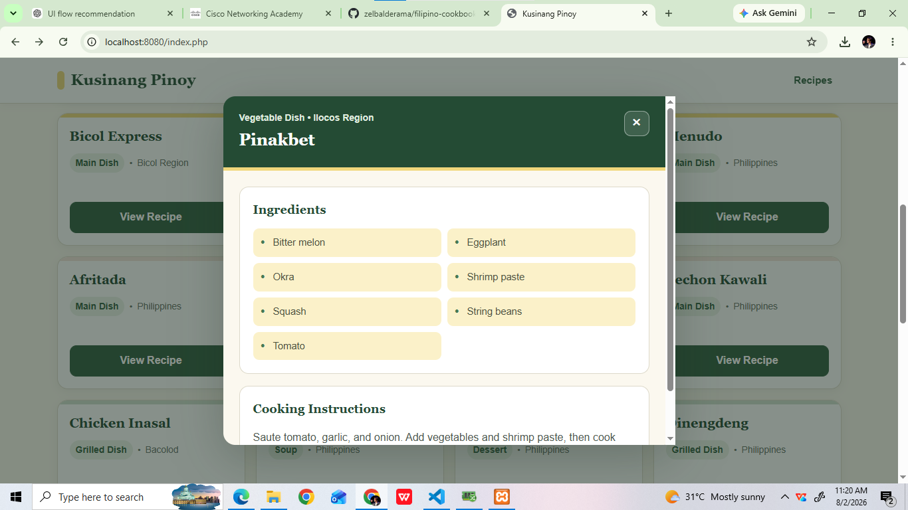
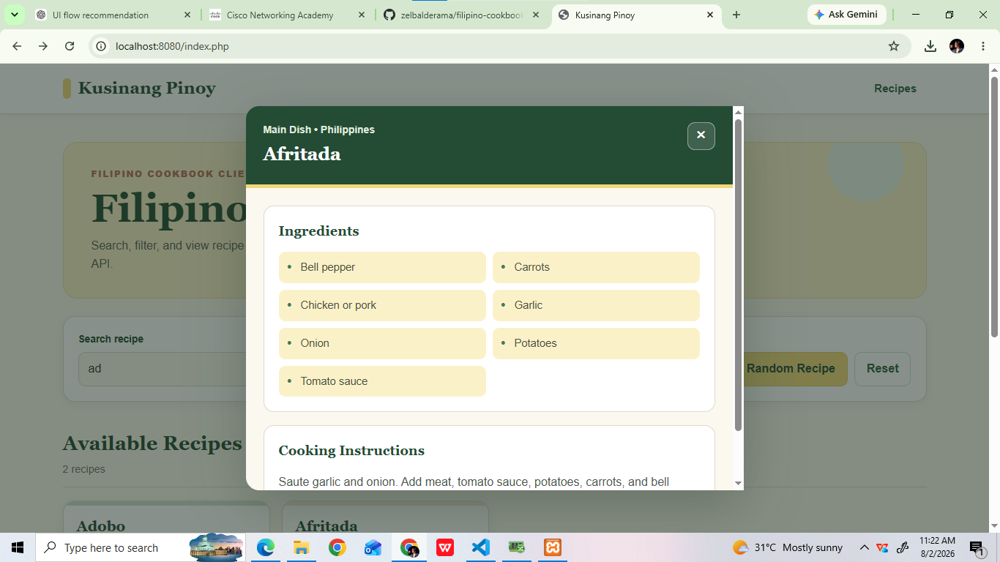
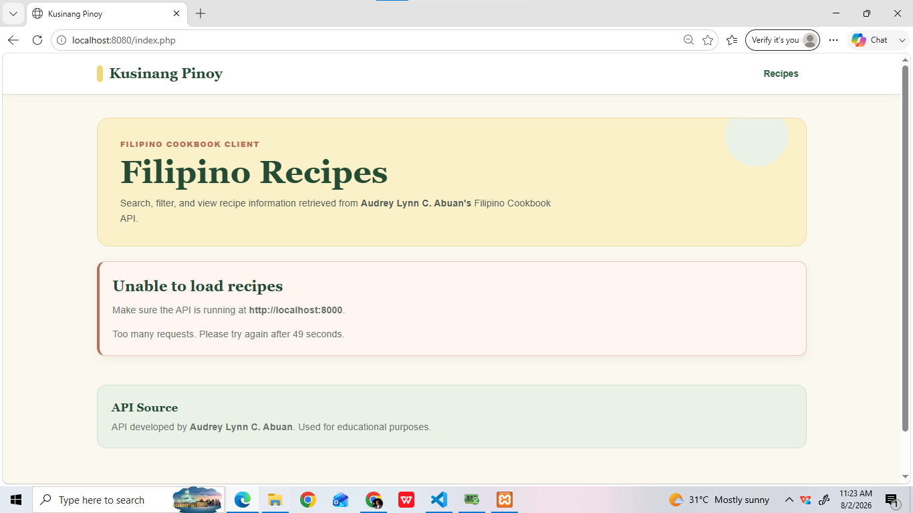

# Kusina Pinoy — Filipino Cookbook Client

## Application Description

Kusina Pinoy is a one-page PHP web client that retrieves and presents Filipino recipe information from the Filipino Cookbook API developed by Audrey Lynn C. Abuan.

The application allows users to:

- Browse Filipino recipes
- Search recipes by food name
- Filter recipes by category
- View recipe details, ingredients, and cooking instructions
- Select a random recipe
- Use the application on desktop, tablet, and mobile devices

The client communicates with the selected API through HTTP requests using Bearer token authentication. It does not directly connect to or access the API developer's MySQL database.

## Major Features

- One-page Filipino cookbook interface
- Responsive recipe card grid
- Search recipes using JavaScript
- Filter recipes by category
- View recipe details in the same page
- Random recipe selection using JavaScript
- Readable loading, empty, and error messages
- Client-side API request rate limiting
- API developer acknowledgment
- Protected local configuration file

## Technologies Used

- PHP 8
- HTML5
- CSS3
- JavaScript
- PHP cURL
- JSON
- XAMPP
- Apache
- Git
- GitHub
- Visual Studio Code
- Thunder Client
- Filipino Cookbook API by Audrey Lynn C. Abuan

## Project Structure

```text
filipino-cookbook-client-balderama/
│
├── config/
│   ├── config.php
│   └── config.example.php
│
├── public/
│   ├── index.php
│   └── assets/
│       ├── css/
│       │   └── style.css
│       └── js/
│           └── app.js
│
├── src/
│   ├── ApiClient.php
│   ├── RateLimiter.php
│   └── SecureApiClient.php
│
├── storage/
│   └── rate-limits/
│       └── .gitkeep
│
├── screenshots/
├── .gitignore
└── README.md
```

## Requirements

Before running the client, prepare the following:

- XAMPP with PHP 8
- Git
- A web browser
- The selected Filipino Cookbook API
- The imported Filipino Cookbook MySQL database
- A valid Bearer token for the selected API

## Installation Instructions

### 1. Clone the client repository

```bash
git clone https://github.com/zelbalderama/filipino-cookbook-client-balderama.git
```

### 2. Open the project directory

```bash
cd filipino-cookbook-client-balderama
```

### 3. Create the local configuration file

Copy:

```text
config/config.example.php
```

Rename the copied file to:

```text
config/config.php
```

### 4. Configure the API connection

Open `config/config.php` and enter the API base URL and Bearer token:

```php
<?php

return [
    'api_base_url' => 'http://localhost:8000',
    'api_token' => 'YOUR_API_TOKEN_HERE',
];
```

The real `config/config.php` file must not be uploaded to GitHub.

### 5. Run the selected API

Open a terminal inside the API project:

```powershell
& "C:\xampp\php\php.exe" -S localhost:8000 -t public
```

The API should be available at:

```text
http://localhost:8000
```

### 6. Run the client application

Open another terminal inside the client project:

```powershell
& "C:\xampp\php\php.exe" -S localhost:8080 -t public
```

### 7. Open the client

Visit:

```text
http://localhost:8080
```

## API Configuration

The local API base URL is:

```text
http://localhost:8000
```

Protected requests use:

```http
Authorization: Bearer YOUR_API_TOKEN_HERE
Accept: application/json
```

The actual token is stored only in `config/config.php`, which is excluded from Git through `.gitignore`.

## API Endpoints Used

### Get All Foods

```http
GET /api/foods
```

Retrieves Filipino food records used to display recipe cards and recipe details.

### Get All Categories

```http
GET /api/categories
```

Retrieves the available food categories used by the category filter.

> Search, category filtering, recipe detail display, and random recipe selection are handled in the one-page client using JavaScript and the food data returned by the API.

## Client-Side Rate Limiting

The client contains a file-based request limiter implemented through:

- `src/RateLimiter.php`
- `src/SecureApiClient.php`
- `storage/rate-limits/`

Default limit:

```text
30 API requests per 60 seconds for each client IP address
```

When the limit is exceeded, the client returns an understandable `429 Too Many Requests` response.

### Rate-Limit Testing

For testing, temporarily set the limit to:

```php
$rateLimiter = new RateLimiter(
    __DIR__ . '/../storage/rate-limits',
    3,
    60
);
```

Refresh the client repeatedly until the rate limit is reached. After testing, restore the normal values.

### Rate-Limit Limitation

The limiter protects only requests passing through this client application. It does not modify or fully protect the original API from direct requests made through Postman, Thunder Client, or another external client.

## Application Features

### Recipe Browsing

The home page displays Filipino recipes in a responsive card grid.

### Search

Users can search recipes by food name without leaving the page.

### Category Filter

Users can select a food category to narrow the displayed recipes.

### Recipe Details

The **View Recipe** button displays the selected recipe's:

- Name
- Category
- Origin
- Ingredients
- Cooking instructions

### Random Recipe

The Random Recipe feature selects one recipe from the loaded API data using JavaScript.

## Error Handling

The client displays readable messages when:

- The API server is unavailable
- Authentication fails
- The API returns an invalid response
- No recipe matches the search
- No recipe belongs to the selected category
- The request limit is exceeded

The application does not display raw JSON as its final interface.

## Testing

The following should be tested before submission:

- The selected API repository can be cloned
- Composer dependencies can be installed for the API
- The database can be imported
- The API runs successfully
- Bearer token authentication works
- `GET /api/foods` returns valid JSON
- `GET /api/categories` returns valid JSON
- The client displays recipe information
- Search works
- Category filtering works
- View Recipe works
- Random Recipe works
- Invalid or missing authentication produces a readable error
- Rate limiting produces a readable `429` response
- The client does not directly access MySQL
- The API token is not uploaded to GitHub

## Screenshots

Place the screenshots inside the `screenshots/` folder.

### Main Interface


### Recipe Details



### Search or Category Filter


### Random Recipe



### Rate-Limit Response



## API Source and Acknowledgment

This client application uses the Filipino Cookbook API developed by:

**Developer:** Audrey Lynn C. Abuan  
**GitHub Username:** `aabuan04`  
**API Repository:** `https://github.com/aabuan04/filipino-cookbook-api-abuan`

The API is used for educational purposes with the permission of the developer.

## Client Developer

**Name:** `Liezel Mae Balderama`  
**Course and Section:** `Bachelor of Science in Information Technology`  
**GitHub Username:** `zelbalderama`  
**Client Repository:** `[YOUR CLIENT REPOSITORY LINK]`  
**Date Completed:** `August 02, 2026`

## Security Notes

- `config/config.php` contains the real API token and must remain in `.gitignore`.
- `config/config.example.php` contains placeholder values and may be uploaded.
- Generated rate-limit JSON files must not be uploaded.

Recommended `.gitignore` entries:

```gitignore
/config/config.php
/storage/rate-limits/*.json
.env
.DS_Store
Thumbs.db
```

## Educational Purpose

This application was developed for the Collaborative API Development and Integration Activity.
