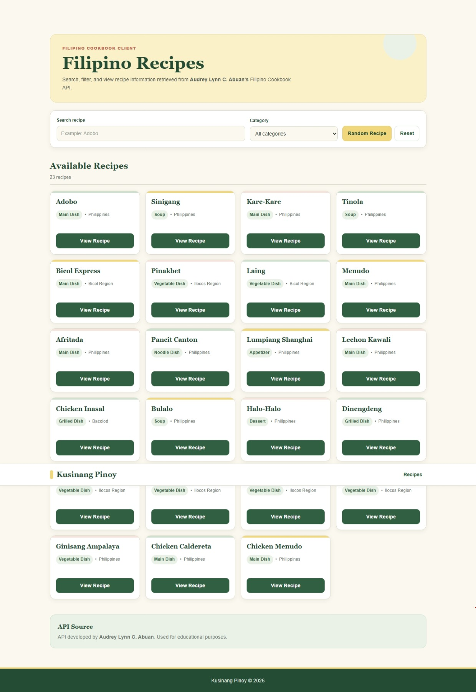
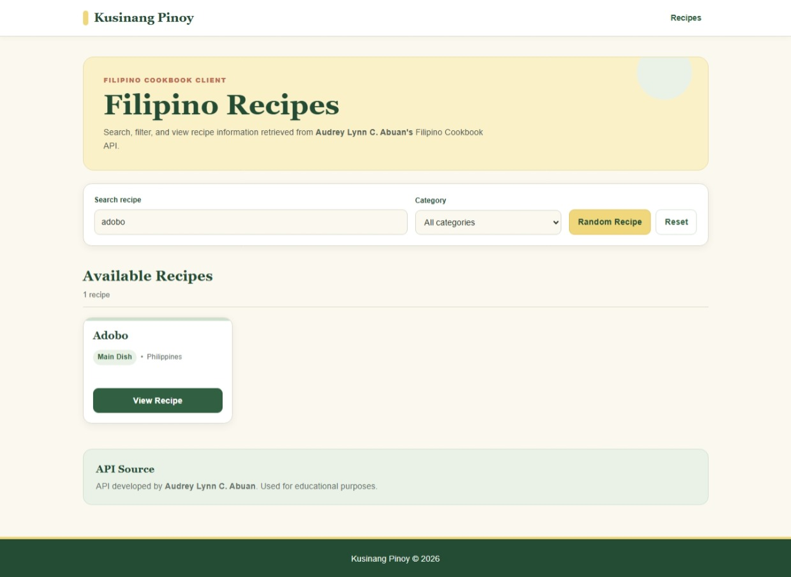
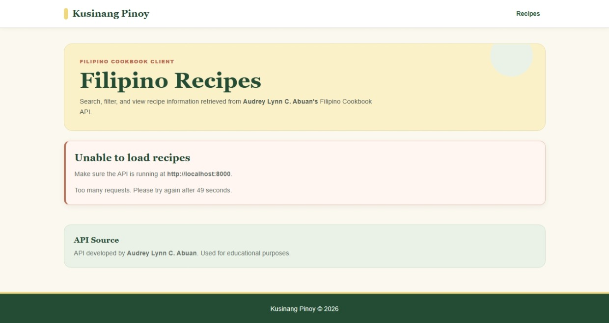
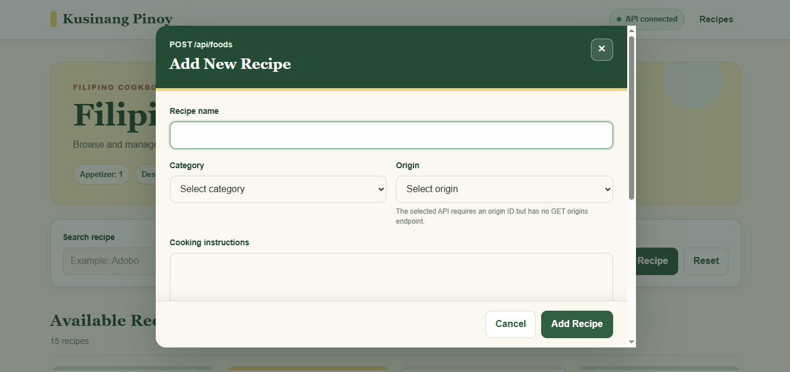

# Kusina Pinoy — Filipino Cookbook Client

## Application Description

**Kusina Pinoy** is a one-page PHP web client that consumes and presents Filipino recipe data from the Filipino Cookbook API developed by **Audrey Lynn C. Abuan**.

The application allows users to:

- Browse all Filipino recipes
- Search recipes by food name
- Filter recipes by category
- View complete recipe details
- Display ingredients and cooking instructions
- Select a random recipe
- View the number of foods under each category
- Add a new recipe using the API's `POST /api/foods` endpoint
- Receive readable validation, duplicate, rate-limit, and API error messages
- Use the application on desktop, tablet, and mobile devices

The client communicates with the selected API through HTTP requests using Bearer token authentication. It does not directly connect to or access the API developer's MySQL database.

---

## Major Features

- One-page Filipino cookbook interface
- Responsive recipe card grid
- Endpoint-based recipe search
- Endpoint-based category filtering
- Endpoint-based random recipe selection
- Endpoint-based recipe detail retrieval
- Category summary display
- Add Recipe modal
- Ingredient selection using API data
- Duplicate recipe-name checking before submission
- Client-side API request rate limiting
- Readable loading, empty, success, and error messages
- API developer acknowledgment
- Protected local configuration file
- Bearer token kept outside browser JavaScript

---

## Technologies Used

- PHP 8
- HTML5
- CSS3
- JavaScript
- PHP cURL
- JSON
- Slim API
- MySQL
- XAMPP
- Git
- GitHub
- Visual Studio Code
- Thunder Client
- Filipino Cookbook API by Audrey Lynn C. Abuan

---

## Project Structure

```text
filipino-cookbook-client-balderama/
│
├── config/
│   ├── config.php
│   ├── config.example.php
│   └── origins.php
│
├── public/
│   ├── index.php
│   ├── client-api.php
│   └── assets/
│       ├── css/
│       │   └── style.css
│       └── js/
│           └── app.js
│
├── src/
│   ├── ApiClient.php
│   ├── RateLimiter.php
│   └── SecureApiClient.php
│
├── storage/
│   └── rate-limits/
│       └── .gitkeep
│
├── screenshots/
│   ├── 01-main-interface.jpeg
│   ├── 02-recipe-details.png
│   ├── 03-search-filter.jpeg
│   ├── 04-random-recipe.png
│   ├── 05-rate-limit-response.jpeg
│   └── 06-add-food.png
│
├── .gitignore
└── README.md
```

---

## Requirements

Before running the client, prepare the following:

- XAMPP with PHP 8
- Git
- A modern web browser
- The selected Filipino Cookbook API
- The imported Filipino Cookbook MySQL database
- A valid Bearer token for the selected API

---

## Installation Instructions

### 1. Clone the client repository

```bash
git clone https://github.com/zelbalderama/filipino-cookbook-client-balderama.git
```

### 2. Open the project directory

```bash
cd filipino-cookbook-client-balderama
```

### 3. Create the local configuration file

Copy:

```text
config/config.example.php
```

Rename the copied file to:

```text
config/config.php
```

### 4. Configure the API connection

Open `config/config.php` and enter the API base URL and Bearer token:

```php
<?php

return [
    'api_base_url' => 'http://localhost:8000',
    'api_token' => 'YOUR_API_TOKEN_HERE',
];
```

The real `config/config.php` file must not be uploaded to GitHub.

### 5. Run the selected API

Open a terminal inside the API project:

```powershell
& "C:\xampp\php\php.exe" -S localhost:8000 -t public
```

The API should be available at:

```text
http://localhost:8000
```

### 6. Run the client application

Open another terminal inside the client project:

```powershell
& "C:\xampp\php\php.exe" -S localhost:8080 -t public
```

### 7. Open the client

Visit:

```text
http://localhost:8080
```

---

## API Configuration

The local API base URL is:

```text
http://localhost:8000
```

Protected API requests use:

```http
Authorization: Bearer YOUR_API_TOKEN_HERE
Accept: application/json
```

POST requests also use:

```http
Content-Type: application/json
```

The actual token is stored only in `config/config.php`, which is excluded from Git through `.gitignore`.

The browser does not directly receive the Bearer token. JavaScript sends requests to `public/client-api.php`, and the PHP client sends the authenticated request to the selected API.

---

## How the Client Connects to the API

The request flow is:

```text
User action
    ↓
public/index.php
    ↓
public/assets/js/app.js
    ↓
public/client-api.php
    ↓
src/SecureApiClient.php
    ↓
src/RateLimiter.php
    ↓
src/ApiClient.php
    ↓
Audrey Lynn C. Abuan's API
    ↓
MySQL database
    ↓
JSON response
    ↓
Client interface
```

### File responsibilities

- `public/index.php` provides the visible interface.
- `public/assets/js/app.js` handles buttons, forms, dialogs, and JSON rendering.
- `public/client-api.php` validates requests and maps client actions to API endpoints.
- `src/SecureApiClient.php` checks the request limit before calling the API.
- `src/RateLimiter.php` performs the actual request counting.
- `src/ApiClient.php` sends authenticated GET and POST requests using PHP cURL.
- `config/config.php` stores the private API base URL and token.
- `config/origins.php` stores valid origin IDs because the selected API does not provide `GET /api/origins`.

---

## API Endpoints Used

### Public API Status

```http
GET /
```

Checks whether the selected API server is running.

### Get All Foods

```http
GET /api/foods
```

Retrieves all food records used to display the main recipe cards.

### Get One Food by ID

```http
GET /api/foods/{id}
```

Retrieves the complete details of the selected recipe.

### Search Food by Name

```http
GET /api/foods/search/{name}
```

Searches recipes using the food name entered by the user.

This endpoint is also used before adding a recipe to check for an existing recipe with the same normalized name.

### Get a Random Food

```http
GET /api/foods/random
```

Retrieves one random recipe for the Random Recipe feature.

### Get All Categories

```http
GET /api/categories
```

Retrieves categories used by:

- The main category filter
- The Add Recipe category dropdown

### Get Foods by Category

```http
GET /api/categories/{id}/foods
```

Retrieves foods belonging to the selected category.

### Get Category Summary

```http
GET /api/categories/summary
```

Retrieves the number of foods stored under each category.

### Get All Ingredients

```http
GET /api/ingredients
```

Retrieves the ingredient choices displayed in the Add Recipe modal.

### Add a New Food

```http
POST /api/foods
```

Creates a new food record using the following JSON structure:

```json
{
  "food_name": "Sample Recipe",
  "category_id": 1,
  "origin_id": 4,
  "instructions": "Prepare and cook the ingredients.",
  "ingredient_ids": [1, 2, 3]
}
```

---

## Add Recipe Process

When the user submits the Add Recipe form:

1. JavaScript reads the recipe name, category, origin, cooking instructions, and selected ingredients.
2. JavaScript performs basic required-field validation.
3. The form data is sent as JSON to `client-api.php?action=add`.
4. `client-api.php` validates the submitted values again.
5. The client calls `GET /api/foods/search/{name}` to check for an existing recipe.
6. Recipe names are normalized by trimming repeated spaces and ignoring letter case.
7. If an exact duplicate exists, the client returns `409 Conflict`.
8. The duplicate warning is displayed at the bottom of the Add Recipe modal.
9. If no duplicate exists, the client calls `POST /api/foods`.
10. The selected API inserts the food and its ingredient relationships.
11. The client refreshes the food list and category summary.
12. A success message is displayed before the modal closes.

### Duplicate example

The following names are treated as the same:

```text
Chicken Adobo
CHICKEN ADOBO
  Chicken   Adobo
```

---

## Category, Origin, and Ingredient Limitations

### Categories

Categories are loaded from:

```http
GET /api/categories
```

The selected API does not provide:

```http
POST /api/categories
```

Therefore, the client can only use existing categories.

### Ingredients

Ingredients are loaded from:

```http
GET /api/ingredients
```

The selected API does not provide:

```http
POST /api/ingredients
```

Therefore, the client can only select existing ingredient IDs.

### Origins

The selected API requires `origin_id` when adding a food, but it does not provide:

```http
GET /api/origins
POST /api/origins
```

For this reason, valid origin IDs from the supplied database are stored in:

```text
config/origins.php
```

A new origin must already exist in the selected API database before its ID can be added to `config/origins.php`.

---

## Client-Side Rate Limiting

The client contains a file-based request limiter implemented through:

- `src/RateLimiter.php`
- `src/SecureApiClient.php`
- `storage/rate-limits/`

Current limit:

```text
60 API requests per 60 seconds for each client IP address
```

### How it works

1. `client-api.php` creates the `RateLimiter` configuration.
2. `SecureApiClient.php` checks the visitor's request allowance.
3. `RateLimiter.php` stores request timestamps in JSON files.
4. If the request is allowed, `ApiClient.php` calls the selected API.
5. If the request is blocked, the client returns:

```text
429 Too Many Requests
```

### Rate-Limit Testing

For testing, temporarily change the limit in `public/client-api.php`:

```php
$rateLimiter = new RateLimiter(
    __DIR__ . '/../storage/rate-limits',
    3,
    60
);
```

Refresh or use the client repeatedly until the request limit is reached. Restore the normal limit after testing.

### Rate-Limit Limitation

The limiter protects only requests passing through this client application. It does not fully protect the original API from direct requests made through Postman, Thunder Client, another website, or another application.

---

## Application Features

### Recipe Browsing

The home page calls `GET /api/foods` and displays the returned recipes in a responsive card grid.

### Search

The search form calls:

```http
GET /api/foods/search/{name}
```

### Category Filter

The category filter calls:

```http
GET /api/categories/{id}/foods
```

### Recipe Details

The **View Recipe** button calls:

```http
GET /api/foods/{id}
```

It displays the selected recipe's:

- Name
- Category
- Origin
- Ingredients
- Cooking instructions

### Random Recipe

The Random Recipe button calls:

```http
GET /api/foods/random
```

### Add Recipe

The Add Recipe modal uses:

```http
GET /api/categories
GET /api/ingredients
GET /api/foods/search/{name}
POST /api/foods
```

### Category Summary

The category badges use:

```http
GET /api/categories/summary
```

---

## Error Handling

The client displays readable messages when:

- The API server is unavailable
- Authentication fails
- The API returns invalid JSON
- A food ID is invalid
- A category ID is invalid
- No recipe matches a search
- No recipe belongs to the selected category
- Required Add Recipe fields are missing
- No ingredient is selected
- A recipe name already exists
- The request limit is exceeded
- The API cannot create the food

The application does not display raw JSON as its final interface.

### Common HTTP status codes

| Status | Meaning |
|---|---|
| `200 OK` | A GET request completed successfully |
| `201 Created` | A new recipe was added successfully |
| `400 Bad Request` | Submitted data is missing or invalid |
| `401 Unauthorized` | The Bearer token is missing or invalid |
| `404 Not Found` | The requested food, category, or action does not exist |
| `405 Method Not Allowed` | The wrong HTTP method was used |
| `409 Conflict` | A recipe with the same name already exists |
| `429 Too Many Requests` | The client request limit was reached |
| `500 Internal Server Error` | A server or database operation failed |

---

## Testing

The following should be tested before submission:

- The selected API repository can be cloned
- Composer dependencies can be installed for the API
- The MySQL database can be imported
- The API runs successfully on port `8000`
- The client runs successfully on port `8080`
- Bearer token authentication works
- `GET /` confirms that the API is available
- `GET /api/foods` returns valid JSON
- `GET /api/categories` returns valid JSON
- `GET /api/categories/summary` returns valid JSON
- `GET /api/ingredients` returns valid JSON
- `GET /api/foods/{id}` returns one food
- `GET /api/foods/search/{name}` returns matching foods
- `GET /api/categories/{id}/foods` filters by category
- `GET /api/foods/random` returns one random food
- `POST /api/foods` creates a new recipe
- Duplicate recipe names produce a readable `409` warning
- Search works
- Category filtering works
- View Recipe works
- Random Recipe works
- Add Recipe works
- Missing form data produces readable validation messages
- Invalid or missing authentication produces a readable error
- Rate limiting produces a readable `429` response
- The client does not directly access MySQL
- The API token is not uploaded to GitHub

---

## Screenshots

Place the screenshots inside the `screenshots/` folder.

### Main Interface



### Recipe Details


### Search or Category Filter



### Random Recipe


### Rate-Limit Response



### Add Recipe



---

## API Source and Acknowledgment

This client application uses the Filipino Cookbook API developed by:

**Developer:** Audrey Lynn C. Abuan  
**GitHub Username:** `aabuan04`  
**API Repository:** `https://github.com/aabuan04/filipino-cookbook-api-abuan`

The API is used for educational purposes with the permission of the developer.

---

## Client Developer

**Name:** `Liezel Mae Balderama`  
**Course and Section:** `Bachelor of Science in Information Technology`  
**GitHub Username:** `zelbalderama`  
**Client Repository:** `https://github.com/zelbalderama/filipino-cookbook-client-balderama`  
**Date Completed:** `August 02, 2026`

---

## Security Notes

- `config/config.php` contains the real API token and must remain in `.gitignore`.
- `config/config.example.php` contains placeholder values and may be uploaded.
- The token must not be placed inside `app.js`.
- Generated rate-limit JSON files must not be uploaded.
- The client does not directly access the selected API's MySQL database.
- API and database error details should not be displayed directly to users.

Recommended `.gitignore` entries:

```gitignore
/config/config.php
/storage/rate-limits/*.json
.env
.DS_Store
Thumbs.db
```

---

## Educational Purpose

This application was developed for the **Collaborative API Development and Integration Activity**.
